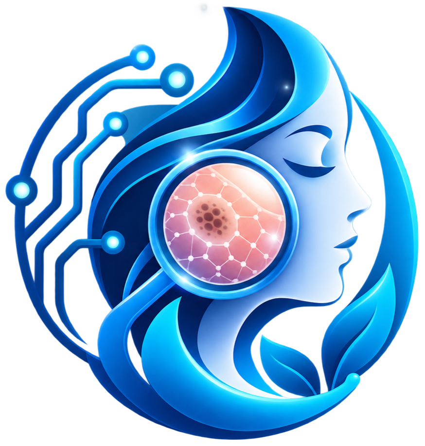

<div align="center">


<br/>



# Demeology-AI


Demeology-AI is an advanced web-based clinical assistant designed to support dermatological diagnostics. The application integrates computer vision models with natural language processing to analyze patient skin imagery and generate detailed, professional medical insights.

</div>

## System Architecture

The application is structured into two primary components:
- A high-performance Python/Flask backend responsible for processing images, orchestrating machine learning models, and securely handling API communications.
- A dynamic, responsive frontend built with vanilla HTML, CSS, and JavaScript, featuring a custom design system with native light and dark mode support.

## How It Works (The Role of AI)

The intelligence of Demeology-AI is powered by a dual-AI approach, combining local machine learning with cloud-based generative AI to provide a complete diagnostic experience:

1. **Visual Recognition (PyTorch / Transformers)**:
   When a user uploads a skin image, the local PyTorch model acts as the "eyes" of the system. It analyzes the visual features of the skin condition and classifies it (e.g., Melanoma, Eczema) while calculating a confidence score.

2. **Clinical Synthesis (OpenAI GPT-3.5)**:
   Once the disease is visually identified, the OpenAI API acts as the "expert consultant". It takes the predicted disease name, along with the patient's provided age, gender, and medical history, to generate a highly detailed, professional medical report in JSON format. This report includes potential causes, a recommended skincare routine, lifestyle tips, and advice on when to seek a doctor.

This synergy ensures the system not only identifies the visual symptoms but also contextualizes them into actionable medical advice.

## Core Capabilities

- Image Classification: Utilizes Hugging Face Transformers to classify skin conditions across multiple diagnostic categories.
- Diagnostic Synthesis: Integrates with OpenAI's API to construct comprehensive clinical narratives, outlining potential causes, recommended care routines, and immediate next steps based on the visual findings.
- Client-Side Processing: Features a drag-and-drop interface with local image preview and client-side validation to minimize unnecessary server load.
- Adaptive Interface: Incorporates a modern, glassmorphism-inspired UI that seamlessly adapts to the user's system preferences.

## Technical Requirements

- Python 3.9 or higher
- PyTorch
- Hugging Face Transformers
- Flask and Flask-CORS
- OpenAI Python Client

## Local Deployment

1. Clone the repository to your local machine:
   ```bash
   git clone https://github.com/Akshay-gurav-31/Demeology-AI.git
   cd Demeology-AI
   ```

2. Create and activate a virtual environment:
   ```bash
   python -m venv venv
   source venv/bin/activate
   ```

3. Install the required dependencies:
   ```bash
   pip install -r requirements.txt
   ```

4. Configure the environment variables by creating a `.env` file in the root directory:
   ```
   OPENAI_API_KEY=your_openai_api_key_here
   ```

5. Start the application server:
   ```bash
   python app.py
   ```

The application will be accessible at http://localhost:5001.

## Disclaimer

This software is developed for informational and educational purposes. It is not intended to replace professional medical advice, diagnosis, or treatment. Users should always seek the guidance of a qualified healthcare provider for medical concerns.

<div align="center">


</div>
